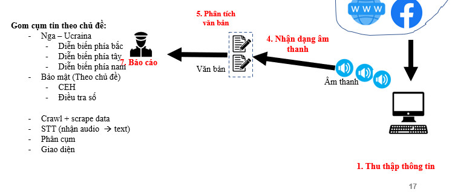

## CD2 : Xây dựng hệ thống Osint Phân tích tin tức

thư viện **topic modeling** -> đưa vào **tập văn bản** -> đầu ra **từ khóa** và **trọng số** là tần xuất xuất hiện

đếm tần suất xuất hiện

loại bỏ stop word

